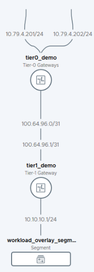

# Automating NSX with Terraform

Examples here uses NSX-T Policy API. 

In all iterations, at the end of the Terraform script, there is a static route added to the Ubuntu host which is basically a VM connected to the same VLAN which the Tier0 uplink is connected to. It is purely optional and that section can be deleted if desired.

## Iteration-2

This example implements an active / standby Tier 0 configuration with Tier 1 and an overlay segment attached to Tier 1. The overlay segment has DHCP configured. As of May 2020 there does not seem to be support for HA VIP config on Tier 0. Hence that needs to be configured manually.

## Iteration-TKG

This example also provisions the same topology as iteration 1 and 2, however it has the Github based binaries for NSX Plugin for Terraform and configures the environment for VNware TKG installation. It usese VLAN ID = 0 for Tier 0 uplink vlan segment. Credit goes to [@jayunit100](https://github.com/jayunit100)

### Using The NSX-T Provider on Github

NSX Provider for Terraform is continuously developed and maintained by VMware on [Github](https://github.com/terraform-providers/terraform-provider-nsxt#developing-the-provider). For the latest features you would want to download it from the above URL and manually compile it. For manual installation of the provider the instructions are [here](https://github.com/terraform-providers/terraform-provider-nsxt#manual-installation).

The version that Terraform automatically pulls when you perform "terraform init" is the GA version of the code and may not have the latest features. 

